#  Student Score Prediction System (Frontend)

 **Live Demo:** [https://sms-project-frontend.vercel.app/](https://sms-project-frontend.vercel.app/)


The **Student Score Prediction System** is a web-based application that predicts students’ academic performance using machine learning models.  
This repository contains the **frontend**, built with **React (Vite)** and styled using **Tailwind CSS v4**.

It provides an intuitive interface for uploading student data, visualizing predicted scores, and managing user dashboards.

---

##  Features
-  Predicts student academic scores based on input parameters  
-  Integration with trained ML model via API  
-  JWT-based authentication  
-  Role-based dashboards (Student, Teacher, Admin)  
-  Data visualization of predicted and actual scores  
-  Modern and responsive UI with Tailwind CSS  

---

##  Tech Stack

| Layer | Technologies Used |
|--------|-------------------|
| **Frontend** | React (Vite), Tailwind CSS v4 |
| **UI/UX** | ShadCN/UI, Lucide React, Framer Motion |
| **API Handling** | Axios (custom `apiConnector.js`) |
| **Routing** | React Router DOM |
| **Backend (for reference)** | Django REST Framework + ML Model |

---

##  Installation and Setup

Follow these steps to run the frontend locally:

```bash
# 1️ Clone the repository
git clone https://github.com/your-username/student-score-prediction-frontend.git

# 2️ Move into the directory
cd student-score-prediction-frontend

# 3️ Install dependencies
npm install

# 4️ Start the development server
npm run dev

##  Project Screenshots

###  Student Views
<p align="center">
  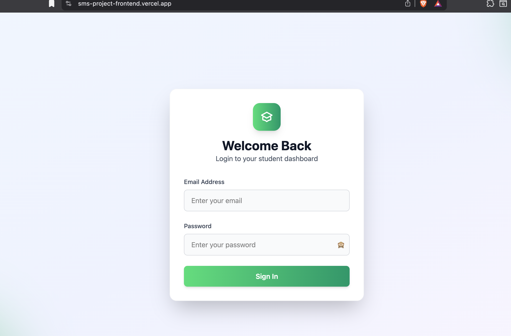
  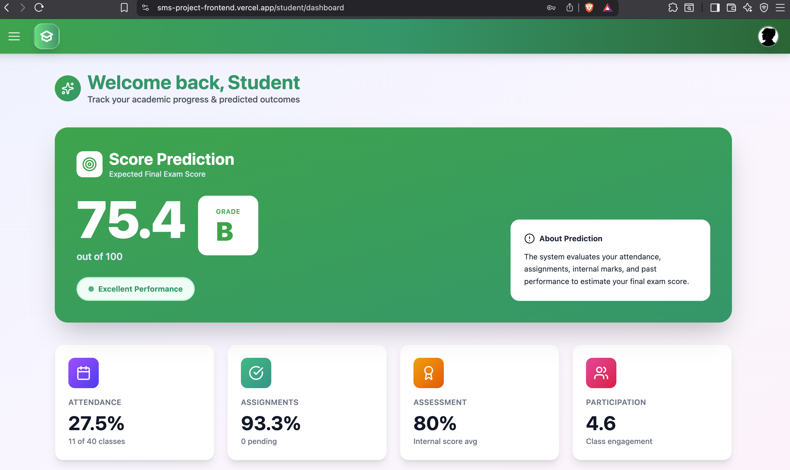
  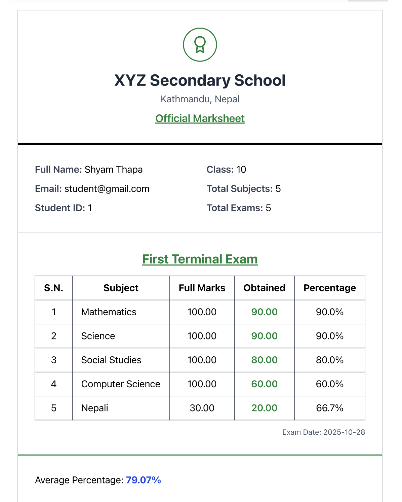
  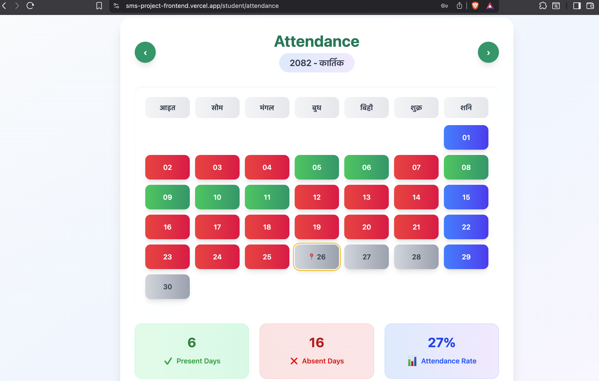
  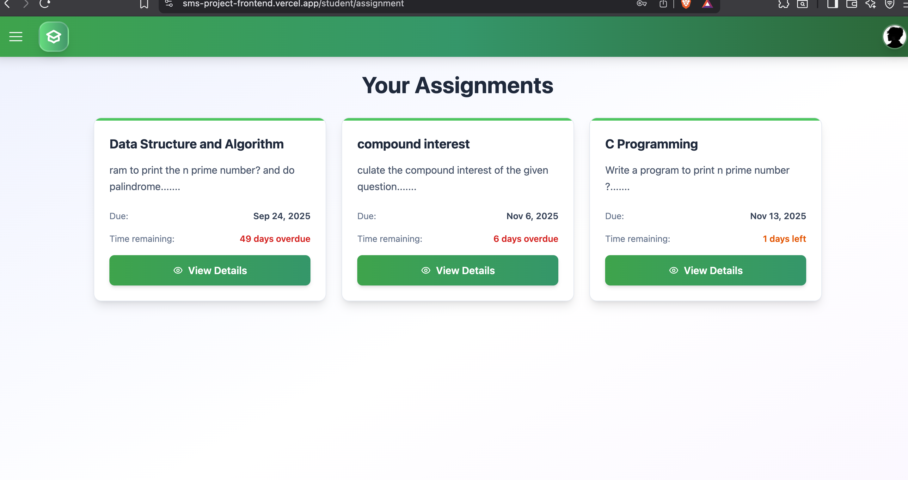
</p>

###  Teacher Views
<p align="center">
  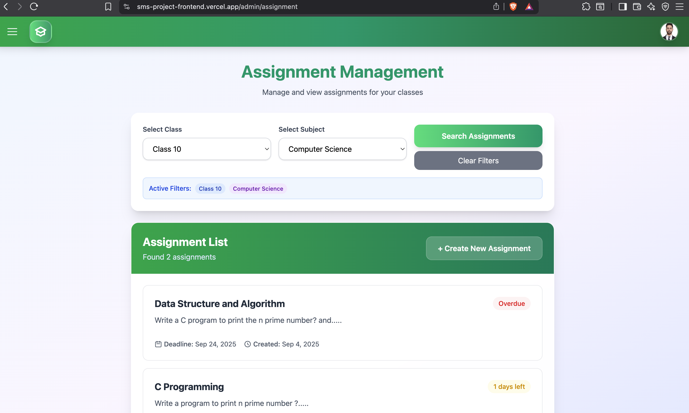
  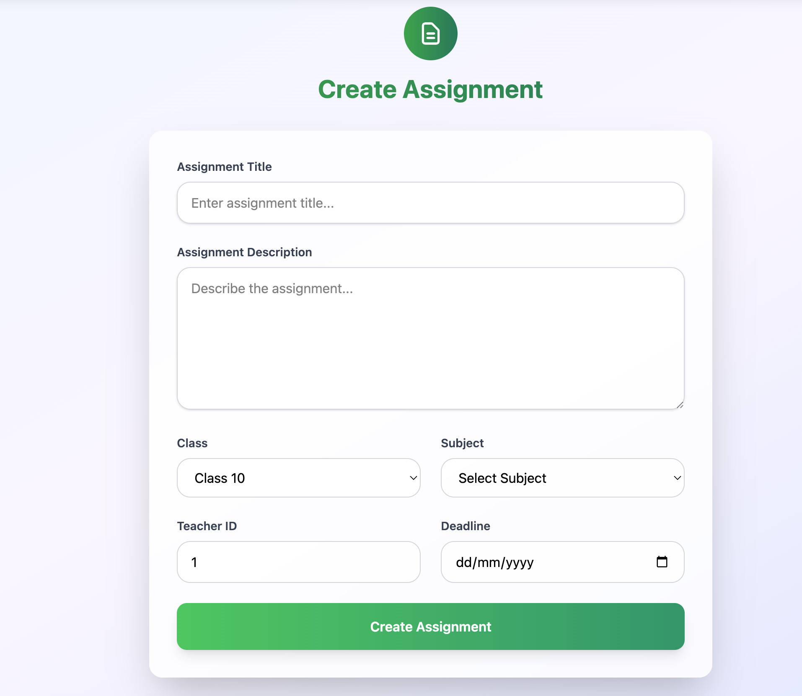
  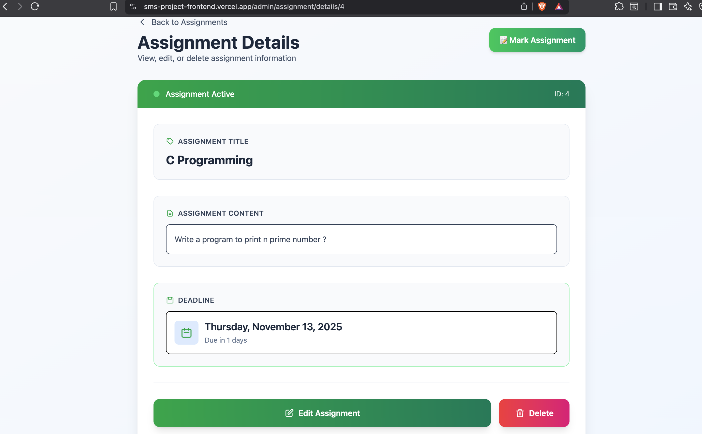
  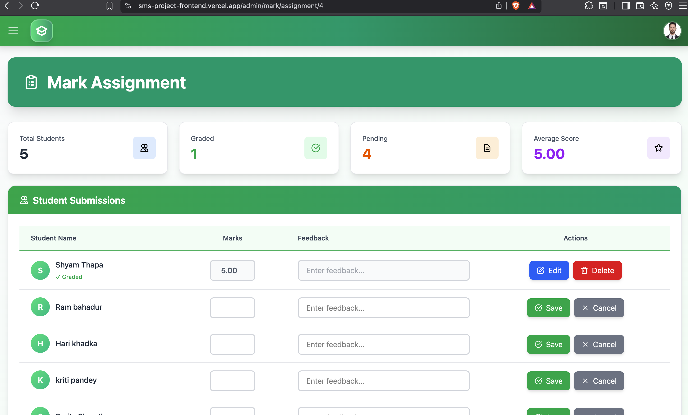
  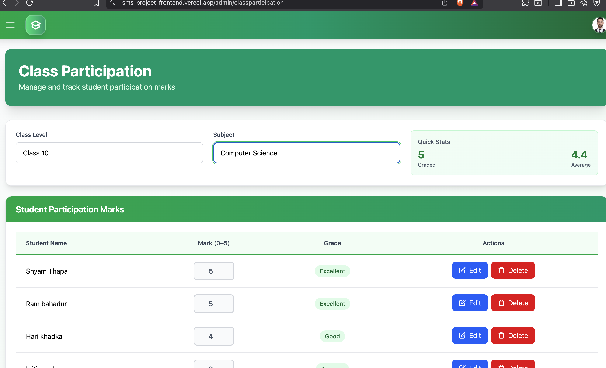
</p>

###  Admin Views
<p align="center">
  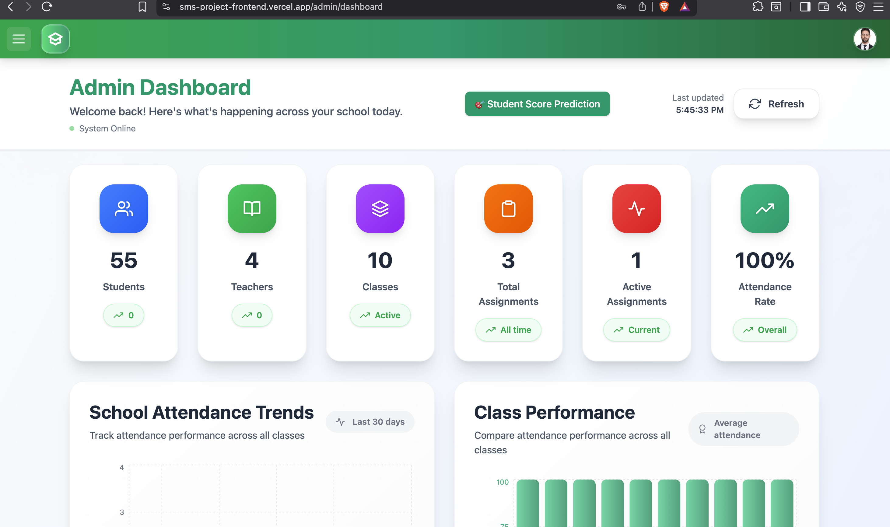
  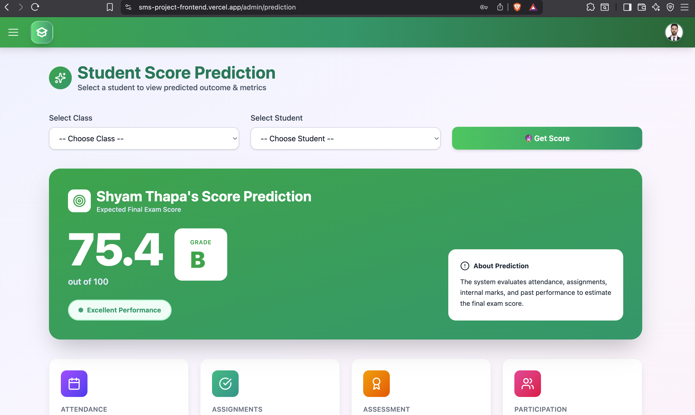
  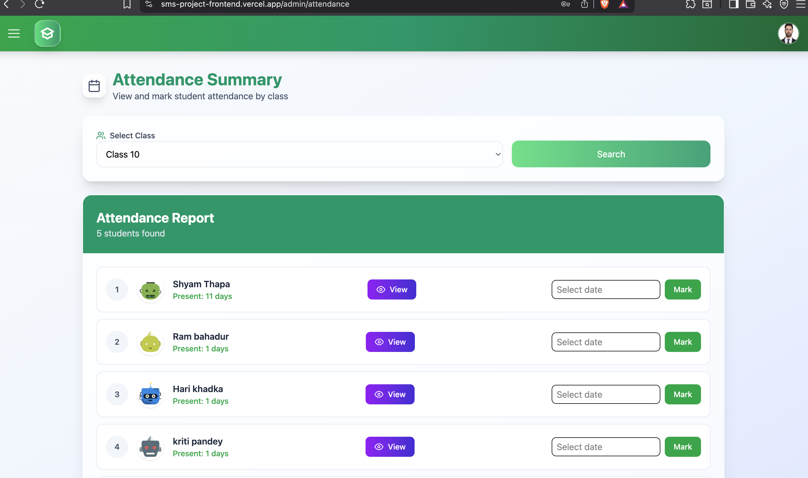
  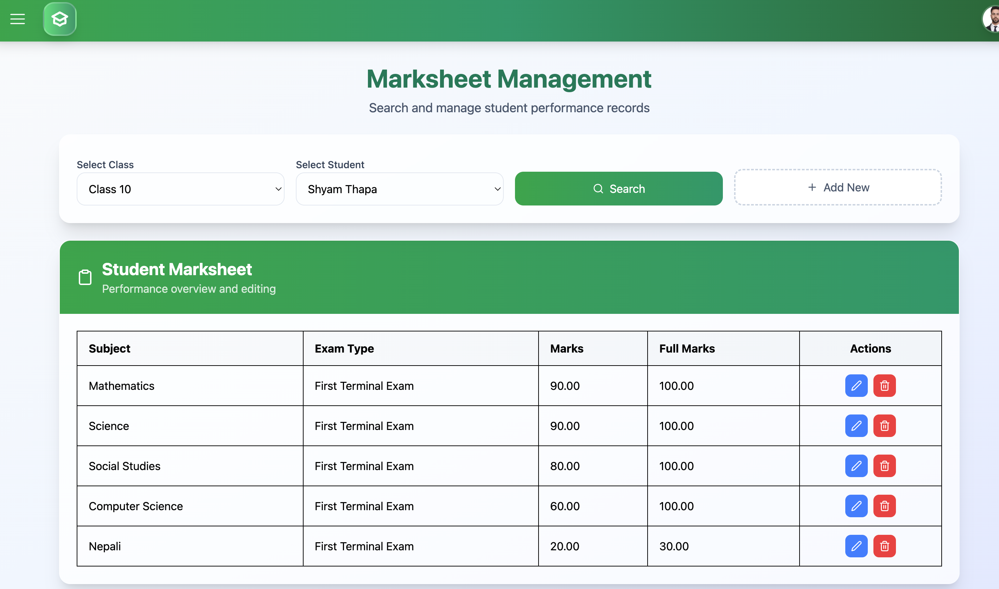
  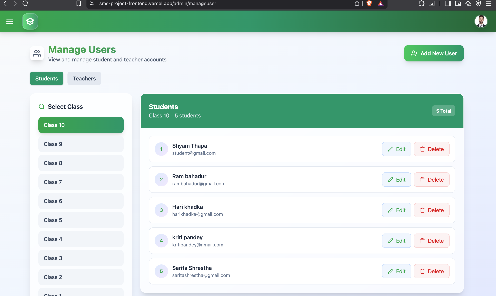
  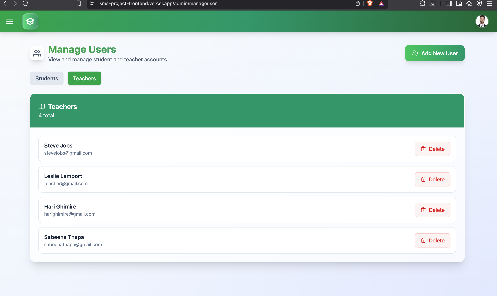
</p>

